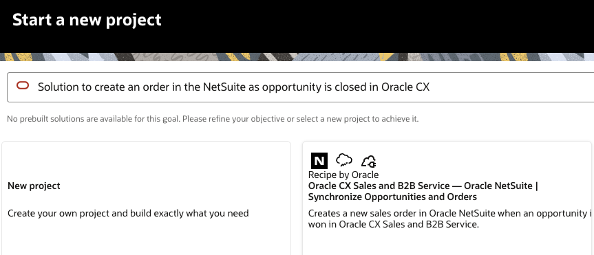

# Install Recipe to Synchronize Oracle CX Sales Opportunities with NetSuite Sales Orders

## Introduction

This lab walks you through the steps to find and install a recipe which synchronizes Oracle CX Sales opportunities and NetSuite sales orders.

### Objectives

* Create a Project
* Find an existing Recipe using the AI Assistant and add it to the Project
* Configure connections included in the Recipe

### Prerequisites

This lab assumes you have:

* Completed all prerequisites and prior setup tasks successfully

## Task 1: Find and Install Recipe

1. Login to your Oracle Integration console.

2. In the left navigation pane, click **Projects**.

3. Click **Add**.

    The **Start a new project** panel appears.

4. Click **Create**.

5. On the **Start a new project** page, copy below use case description, paste it in the chat box and press **Enter**.

    ```
    <copy>
    Solution to create an order in NetSuite as opportunity is closed in Oracle CX
    </copy>
    ```

    Based on the entered use case description, the AI Assistant will display the relevant recipe for this workshop.

6. Click **Choose** to select the displayed recipe.

    
    The recipe you selected starts installing. Once the installation is complete, the Configuration Editor page appears.

## Task 2: Configure Connections

On the **Connections** subpage, the following connections will be shown:

* Oracle REST Connection
* Oracle NetSuite Connection
* Oracle Engagement (CX Sales) Cloud Connection

We will configure each of these connections.

1. Hover over a connection and click **Edit** (pencil) icon.

2. In the **Use a shared connection** box, type the keyword `Live` and then select the appropriate configuration from the list of shared connections. Click **Save** after selecting a shared connection.

    | Connection | Select with Shared Connection |
    | ---------- | ------------------------------ |
    | Oracle REST Connection | LiveLabs - Oracle REST Connection |
    | Oracle NetSuite Connection | LiveLabs - Oracle NetSuite Connection |
    | Oracle Engagement (CX Sales) Cloud Connection | LiveLabs - Oracle CX Cloud Connection |
    {: title="Configure Connections"}

3. Click **Go Back <** and repeat **task 8** until all connections have status **Configured**.

    ```
    Note: If you don't want to configure the connections using shared connections, configure the connections as needed with custom properties.
    ```

## Task 3: Activate Project

After the connections have been configured, you will activate the project. Project activation or deactivation results in bulk processing of the selected integrations in the project.

1. In the **Project** workspace, click **Deploy**.

2. With the default project deployment selected, move to the right and click **Activate** button.

    The **Activate project** panel opens.

3. Select the default deployment name, choose **Audit** tracing level, then click **Activate**.

    Wait until all integrations in the Project workspace have status **Active**.

    ```
    Note: If there are deployments available or if you want a separate one, then create a project deployment under the Deploy tab and select the specific integrations and integration versions to include in the project deployment.
    ```

You may now **proceed to the next lab**.

## Learn More

* [Recipe: Synchronize Opportunities in Oracle CX Sales and B2B Service with Oracle NetSuite Orders](https://docs.oracle.com/en/cloud/paas/application-integration/sync-cx-opportunities)

## Acknowledgements

* **Author:** Ravi Chablani, Product Management - Oracle Integration
* **Last Updated:** Ravi Chablani, December 2025
